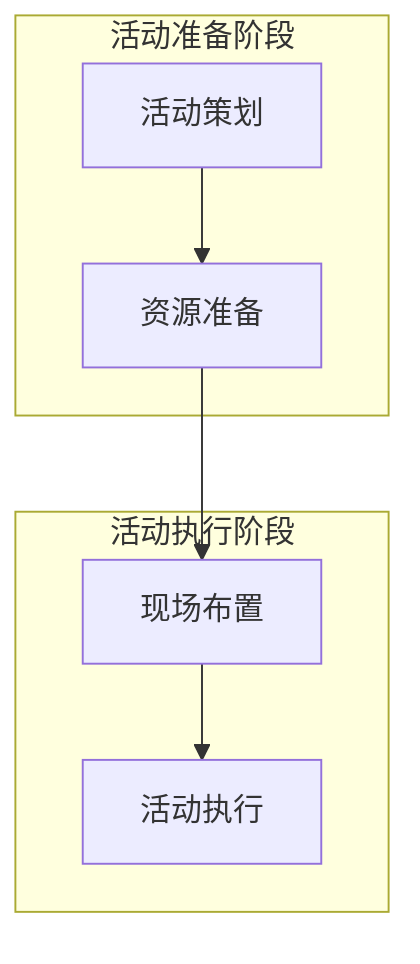

# AI 工作指南

本文档包含 beautiful-mermaid skill 的 AI 工作规则，供 AI 助手参考。

---

## 任务识别规则（强制执行）

### 第0步：检测新建还是继续（每次都要执行）

**检查是否有上次渲染记录**：
- 读取 `.workbuddy/last-render.json` 文件
- 如果文件存在且包含有效的 theme/preset，说明用户之前有渲染过

**弹窗询问用户**：
```
您有以下选择：
1. 继续完善 - 继承上次的主题和预设，继续优化
2. 全新开始 - 创建全新的图表（上次的主题/预设会丢失）

请选择：___
```

- **如果用户选择"继续完善"**：读取 last-render.json 中的 theme/preset，直接进入渲染步骤（跳过 Step 1 打开预览）
- **如果用户选择"全新开始"**：执行下面的标准流程（Step 1 打开预览）

---

### 新任务的标准流程（必须全部执行）

**Step 1 — 打开预览工具（第一优先级）**

首先通过 `execute_command` 工具执行 find 命令找到 skill 实际安装目录（目录名取决于 zip 文件名，不一定是 `beautiful-mermaid`）：

```javascript
// 使用 execute_command 执行 find 命令查找
// 返回结果示例：/Users/chouray/.workbuddy/skills/beautiful-mermaid/SKILL.md
// 取其父目录即为 SKILL_DIR
```

得到 `SKILL_DIR` 后，立即执行：
```javascript
// 优先从 last-render.json 读取上次的主题/预设，传递到 URL 参数
// 这样 preview.html 会自动继承上次的样式（用户无需重新选择）
const lastRender = readRenderState(); // 读取 .workbuddy/last-render.json
const themeParam = lastRender ? `?theme=${lastRender.theme}&preset=${lastRender.preset}` : '';
preview_url("file://" + SKILL_DIR + "/assets/preview.html" + themeParam)
```

- **禁止**：硬编码 `beautiful-mermaid` 作为目录名
- 如果有 last-render.json，URL 参数会自动传递上次的主题/预设（preview.html 会优先使用 URL 参数）
- 不要问用户任何问题，先打开 preview.html
- 等用户在预览界面选择主题和预设

**Step 2 — 记录用户选择（关键：主题必须保留到最终输出）**
- 用户选择完主题和预设后，底部 CLI 命令栏会实时显示选择结果
- **必须记录**用户选择的主题（如 `tokyo-night`）和预设（如 `glass`）
- **这两个值将贯穿后续所有步骤，包括渲染命令和 rich-html.js 命令**

**Step 3 — 生成 .mmd 文件**
- 根据用户描述的业务场景，生成对应的 .mmd 文件
- **禁止**：在生成前读取工作区现有的任何 .mmd 文件
- **禁止**：在生成前询问"让我看看你现有的图表"

**Step 4 — 执行渲染，传递 Step 2 记录的主题**
- 使用 Step 2 记录的主题和预设执行渲染，**必须带 `--theme` 和 `--preset` 参数**
- 单图表：`node scripts/render.js <file.mmd> -t <主题> -p <预设> -o output.svg`
- 多图表聚合：`node scripts/rich-html.js "标题" --diagrams *.mmd --theme <主题> --preset <预设> --output result.html`
- 用 `preview_url` 打开生成的 HTML 结果（`file://` + 绝对路径）

---

- **继续任务的唯一条件**：用户明确说"继续"、"接着上一个"、"在之前基础上"时，才可读取之前的文件继续
- 如果用户只是说"帮我画个流程图"而没有具体内容，可以询问具体需求

---

## 【强制】新任务必须先打开 preview.html

**任何新任务开始时**（无论是用户明确说"全新开始"还是第一次请求生成图表），**都必须先执行以下步骤**：

1. **找到 skill 实际目录**（不得硬编码 `beautiful-mermaid`）：
   ```bash
   find ~/.workbuddy/skills -name "SKILL.md" -exec grep -l "name: beautiful-mermaid" {} \;
   ```
   取结果的父目录路径作为 `SKILL_DIR`

2. **打开 preview.html**（使用 preview_url 工具）：
   ```
   const lastRender = readRenderState();
   const themeParam = lastRender ? `?theme=${lastRender.theme}&preset=${lastRender.preset}` : '';
   preview_url("file://" + SKILL_DIR + "/assets/preview.html" + themeParam)
   ```

3. **【关键】暂停所有操作**

4. **明确告诉用户**："请选择主题和预设，选择完成后告诉我"

5. **等待用户确认选择完成后**，才能继续生成 .mmd 文件

**禁止行为**：
- ❌ 打开 preview.html 后继续生成代码
- ❌ 在用户选择完成前读取现有文件
- ❌ 直接询问用户想要什么主题（必须让用户自己选）
- ❌ 硬编码目录名（如 `~/.workbuddy/skills/beautiful-mermaid/`）

**这是最基础的流程，任何新任务都必须遵守。**

---

## 意图不确定时的确认机制（强制）

当 AI 无法明确判断用户意图时（即用户既没有明确说"继续"，也没有明确说"新任务"，但 AI 感觉可能涉及之前的内容时），**必须主动弹出确认对话框**，不得自行猜测继续。

**触发条件**：
- 用户的请求中包含之前任务中出现的关键词（如之前的业务名称、产品名称、概念等）
- 用户使用了指代词如"这个"、"那个"、"它"、"之前那个"
- 用户只说了很短的话（如"换一个"、"再做一个"）

**确认方式**：
- 使用 `ask_followup_question` 工具提供选项：
  - "继续之前的任务" → 读取并修改现有文件
  - "全新开始一个任务" → **打开 preview.html** 让用户选择主题和预设

**确认后的执行流程**：
- 用户选择"继续之前的任务" → 执行**继续任务流程**（读取现有文件 → 修改 → 渲染）
- 用户选择"全新开始一个任务" → 执行**新任务流程**：
  1. **找到 skill 实际目录**：用 `search_file` 工具查找
  2. **打开 preview.html**（传递 last-render.json 中的主题/预设）：
     ```
     const lastRender = readRenderState();
     const themeParam = lastRender ? `?theme=${lastRender.theme}&preset=${lastRender.preset}` : '';
     preview_url("file://" + SKILL_DIR + "/assets/preview.html" + themeParam)
     ```
  3. **【关键】暂停所有操作，等待用户选择主题和预设**
  4. **【关键】只有用户明确告诉你选择完成后，才能继续下一步**
  5. 记录选择的主题和预设（如 `tokyo-night` + `glass`）——**此值贯穿后续所有渲染命令**
  6. 生成新的 .mmd 文件
  7. 渲染时带上 `--theme <主题> --preset <预设>`，生成结果并 preview_url 打开

**【强制规则】AI 在打开 preview.html 后的行为**：
- ❌ 禁止：打开 preview.html 后继续生成代码或执行其他操作
- ❌ 禁止：在用户选择完成前就准备下一步工作
- ✅ 必须：明确告诉用户"请选择主题和预设，选择完成后告诉我"
- ✅ 必须：等待用户回复"选好了"或类似表示选择完成的信息
- ✅ 只有用户明确确认选择完成后，才能记录主题和预设，继续生成 .mmd 文件
- ✅ **记录的主题/预设必须传递给所有后续渲染命令（包括 render.js 和 rich-html.js）**

**示例对话**：
- 用户说"换一个" → AI 问："请问你是想继续修改之前的图表，还是全新开始？"
- 用户说"再做一种样式" → AI 问："请问你是想在之前基础上添加新样式，还是全新开始？"

**原则**：宁可多问一次，也不要猜错继续导致用户不满。

---

## Mermaid 语法最佳实践与常见问题

### 1. subgraph 子图语法问题处理

**问题描述**：使用 `subgraph` 子图分区语法时，某些主题（特别是 `zinc-light` 的 `outline` 预设）与 subgraph 配合时，Mermaid 布局引擎在计算子图边界时容易出错，导致节点重叠或连线错乱。

**问题示例**：


**解决方案**：
1. **简化子图结构**：避免多层嵌套子图
   ```mermaid
   graph TB
       subgraph 准备阶段
           A[活动策划]
           B[资源准备]
       end
       subgraph 执行阶段
           C[现场布置]
           D[活动执行]
       end
       A --> B
       B --> C
       C --> D
   ```

2. **使用明确的节点 ID 和连接**：
   ```mermaid
   graph TB
       subgraph 准备阶段["准备阶段"]
           A1[活动策划]
           A2[资源准备]
       end
       subgraph 执行阶段["执行阶段"]
           B1[现场布置]
           B2[活动执行]
       end
       A1 --> A2
       A2 --> B1
       B1 --> B2
   ```

3. **避免使用 `zinc-light + outline` 预设处理复杂子图**：
   - 如果用户选择 `zinc-light` 主题和 `outline` 预设，且图表包含复杂 subgraph 结构
   - 建议用户切换到其他主题（如 `tokyo-night`、`github-dark`）或其他预设（如 `glass`、`default`）

### 2. 节点 ID 命名规范

**问题描述**：原代码使用了 `AA`、`BB` 这样的双字母节点 ID（如 `AA[查看物流]`），某些情况下与 subgraph 结合时会产生 ID 解析冲突。

**问题示例**：
```mermaid
graph TB
    subgraph 子图A
        AA[节点A]
        BB[节点B]
    end
    subgraph 子图B
        CC[节点C]
        DD[节点D]
    end
    AA --> BB --> CC --> DD
    // 在某些情况下，AA 可能与 subgraph 的 ID 冲突
```

**解决方案**：
1. **使用描述性节点 ID**：
   ```mermaid
   graph TB
       subgraph 准备阶段
           plan[活动策划]
           resource[资源准备]
       end
       subgraph 执行阶段
           setup[现场布置]
           execute[活动执行]
       end
       plan --> resource --> setup --> execute
   ```

2. **避免使用简单字母组合**：
   - ❌ 避免：`AA`、`BB`、`CC`、`A1`、`B2` 等
   - ✅ 推荐：`start_node`、`process_step`、`decision_point`、`end_result` 等

3. **确保 ID 唯一性**：
   ```mermaid
   graph TB
       subgraph 阶段1
           step1_plan[策划]
           step1_prepare[准备]
       end
       subgraph 阶段2
           step2_setup[布置]
           step2_execute[执行]
       end
       step1_plan --> step1_prepare --> step2_setup --> step2_execute
   ```

### 3. 硬编码颜色问题修复（已自动处理）

**问题描述**：Mermaid 代码中的硬编码颜色（如 `style A fill:#4F46E5` 或 `classDef primary fill:#e0f2fe,stroke:#0284c7`）会直接写入 SVG 的 `fill` 和 `stroke` 属性，覆盖 CSS 变量，导致节点不继承主题色。

**解决方案**：`injectStylesToSVG` 函数已自动处理此问题，会在注入 CSS 样式前清理所有硬编码颜色属性。

**处理规则**：
1. **自动清理**：系统会自动移除以下硬编码颜色属性：
   - `fill="#颜色值"`
   - `stroke="#颜色值"`
   - `style="fill:颜色值; stroke:颜色值"`

2. **CSS 变量优先**：清理后，CSS 变量和 `!important` 规则将生效：
   ```css
   /* 注入的 CSS 样式 */
   #bm-diagram-1 rect[fill="var(--_node-fill)"] {
     fill: var(--_node-fill) !important;
     stroke: var(--_node-stroke) !important;
   }
   ```

3. **主题继承**：节点将正确继承所选主题的颜色，如：
   - `tokyo-night` 主题的深蓝色背景
   - `github-light` 主题的浅色背景
   - 用户选择的预设（`glass`、`outline` 等）样式

**AI 无需特殊处理**：AI 只需正常生成 Mermaid 代码，系统会自动处理硬编码颜色问题。

### 4. 主题与预设兼容性建议

| 图表复杂度 | 推荐主题 | 推荐预设 | 说明 |
|-----------|---------|---------|------|
| **简单流程图**（无 subgraph） | 任意主题 | 任意预设 | 所有主题和预设都兼容 |
| **中等复杂度**（1-2层 subgraph） | 除 `zinc-light` 外 | 除 `outline` 外 | `zinc-light + outline` 可能布局异常 |
| **复杂架构图**（多层嵌套 subgraph） | `tokyo-night`<br>`github-dark`<br>`nord` | `glass`<br>`default`<br>`solid` | 布局引擎最稳定 |
| **XY图表**（柱状图/折线图） | 所有主题 | 所有预设 | 完全兼容 |

**AI 处理流程**：
1. 当用户选择 `zinc-light` 主题和 `outline` 预设时
2. 检查图表是否包含 `subgraph` 语法
3. 如果包含复杂 subgraph 结构，建议用户：
   - 切换到其他主题（如 `tokyo-night`）
   - 或切换到其他预设（如 `glass`）
   - 或简化 subgraph 结构

---

## 暂不支持的图表类型处理规则

当用户请求以下图表类型时，**必须明确告知用户暂不支持**，并提供替代方案：

| 图表类型 | 用户可能的说辞 | 替代方案 |
|---------|---------------|---------|
| **Mindmap（思维导图）** | "思维导图"、"脑图"、"mind map" | 建议使用流程图 `graph TD` 替代，或使用 mermaid.live 导出后用本 skill 转换样式 |
| **Pie Chart（饼图）** | "饼图"、"占比图"、"pie chart" | 建议使用 XY 柱状图替代 |
| **Gantt（甘特图）** | "甘特图"、"项目进度" | 建议使用流程图 + 状态图组合 |
| **Git Graph** | "Git 图"、"版本历史" | 暂无替代，建议使用 mermaid.live |
| **User Journey** | "用户旅程"、"journey" | 暂无替代，建议使用流程图 |

**处理流程**：
1. 检测到用户请求上述图表类型
2. **立即告知**："抱歉，当前版本的 beautiful-mermaid 暂不支持 [图表类型]。支持列表为：流程图、序列图、状态图、类图、ER图、XY图表"
3. 提供替代方案（见上表）
4. 询问用户是否接受替代方案，或等待上游支持后再次尝试

**AI 常见错误（必须避免）**：
- ❌ "让我看看你现有的图表" → **禁止**，新任务不读取现有文件
- ❌ "我看到你已有XX相关的流程图" → **禁止**，这是继承上一个任务的思维
- ❌ 先询问用户想要什么主题 → **禁止**，必须先打开 preview.html 让用户自己选

---

## 继续任务的标准流程（用户说"继续"时执行）

当用户明确说以下话术时，执行继续任务流程：
- "继续"、"接着上一个"
- "在之前基础上"
- "基于XX修改"
- "优化这个图表"
- "修改一下"

**继续任务的标准流程**：

**Step 1 — 读取现有文件 + 上次渲染状态**
- 读取用户指定的 .mmd 文件（如果用户没有指定，列出工作区的 .mmd 文件让用户选择）
- **读取 `.workbuddy/last-render.json` 获取上次渲染时使用的主题和预设**（这是 AI 知道主题/预设的唯一方式）

**Step 2 — 理解修改需求**
- 询问或理解用户想要如何修改（如"增加节点"、"修改流程"、"简化步骤"等）
- 不要重新打开 preview.html，除非用户要求更换主题

**Step 3 — 修改 .mmd 文件**
- 在原有基础上进行修改
- 保留原有的元数据（@title、@desc 等）

**Step 4 — 重新渲染**
- 使用 **last-render.json 中记录的 theme 和 preset** 重新渲染
- 命令示例：`node scripts/render.js <input.mmd> -o <output.svg> -t <theme> -p <preset>`
- 用 `preview_url` 打开结果

---

## 修改/更新 .mmd 文件

当用户要求修改已有的 .mmd 文件时：

1. **先读取现有文件**：了解当前内容
2. **理解修改意图**：询问用户想要如何修改
3. **直接编辑**：使用 replace_in_file 修改文件内容
4. **重新渲染**：执行渲染命令并预览

**修改技巧**：
- 使用 `search_content` 定位需要修改的位置
- 使用 `replace_in_file` 进行精确修改
- 保留元数据注释（%% @xxx 开头的内容）

---

## AI 工作流程完整性强制检查点（最高优先级）

**问题背景**：AI 在执行 beautiful-mermaid skill 时，有时没有完整执行所有步骤，导致最终没有生成 HTML 文件。

**强制检查点规则**：AI 在执行任何 beautiful-mermaid 任务时，必须确保以下所有步骤都完整执行，并在每个步骤后进行验证：

### 检查点 1：工作流程完整性验证
**必须完整执行以下5个步骤**，缺少任何一步都视为工作流程不完整：

1. **Step 1 — 打开预览或读取上次状态**
   - 新任务：打开 preview.html 让用户选择主题/预设
   - 继续任务：读取 `.workbuddy/last-render.json` 获取上次主题/预设
   - ✅ **验证**：确保有明确的主题和预设值

2. **Step 2 — 记录用户选择**
   - 记录用户选择的主题（如 `tokyo-night`）和预设（如 `glass`）
   - ✅ **验证**：主题和预设值不为空

3. **Step 3 — 生成/修改 .mmd 文件**
   - 根据用户需求生成或修改 Mermaid 代码
   - ✅ **验证**：.mmd 文件已成功创建或修改

4. **Step 4 — 必须执行渲染命令**
   - 单图表：`node scripts/render.js <file.mmd> -t <主题> -p <预设> -o output.svg`
   - 多图表：`node scripts/rich-html.js "标题" --diagrams *.mmd --theme <主题> --preset <预设> --output result.html`
   - ✅ **验证**：渲染命令执行成功，输出文件存在

5. **Step 5 — 必须预览结果**
   - 使用 `preview_url("file://" + 绝对路径)` 打开生成的 HTML/SVG 文件
   - ✅ **验证**：`preview_url` 工具被调用

### 检查点 2：渲染命令执行验证
**渲染命令执行后必须验证以下内容**：

```javascript
// 渲染命令示例
const renderCmd = `node scripts/rich-html.js "标题" --diagrams file.mmd --theme ${theme} --preset ${preset} --output result.html`;

// 执行后必须验证
1. 命令执行成功（无错误退出码）
2. 输出文件存在（fs.existsSync(outputPath)）
3. 文件大小 > 0（fs.statSync(outputPath).size > 0）
4. 文件内容包含有效 HTML/SVG 结构

// 如果验证失败，必须：
1. 报告具体错误原因
2. 提供修复建议
3. 重新执行或让用户调整
```

### 检查点 3：主题传递验证
**主题和预设值必须正确传递到所有渲染命令**：

```javascript
// ✅ 正确：主题和预设必须出现在渲染命令中
`node scripts/rich-html.js ... --theme ${theme} --preset ${preset} ...`

// ❌ 错误：缺少主题/预设参数
`node scripts/rich-html.js ...`  // 缺少 --theme 和 --preset

// 验证方法：
1. 检查渲染命令字符串是否包含 `--theme` 和 `--preset` 参数
2. 参数值必须与 Step 2 记录的值一致
3. 参数格式正确（无多余空格、引号问题）
```

### 检查点 4：结果文件预览验证
**生成结果后必须调用 preview_url**：

```javascript
// ✅ 正确：必须调用 preview_url
preview_url(`file://${absolutePath}`);

// ❌ 错误：忘记调用或使用错误工具
// 不要使用 open_result_view 或其他工具预览 HTML 文件

// 验证方法：
1. 确保在工具调用中包含了 preview_url
2. 文件路径必须是绝对路径
3. URL 格式正确（file:// 协议）
```

### AI 常见错误模式（必须避免）
1. **只完成前3步**：打开预览 → 记录选择 → 生成 .mmd → ❌ 停止（缺少渲染和预览）
2. **忘记主题传递**：渲染命令中缺少 `--theme` 和 `--preset` 参数
3. **跳过预览**：生成文件后不调用 `preview_url`
4. **不验证结果**：不检查输出文件是否存在或是否有效

### 强制执行机制
**AI 在每次执行 beautiful-mermaid 任务后必须自查**：
1. 检查是否执行了所有5个步骤
2. 检查是否调用了渲染命令
3. 检查是否调用了 `preview_url`
4. 如果发现缺失，必须立即补全缺失步骤

**用户报告问题时的排查流程**：
1. 询问用户具体哪个步骤没有执行
2. 检查 `.workbuddy/last-render.json` 中的记录
3. 检查工作区是否有新生成的 .html/.svg 文件
4. 检查 AI 的 tool call 历史中是否有渲染命令和 preview_url 调用

---

## AI 预览工作规则

任何涉及渲染 Mermaid 图表的请求，**无论用户是否已指定主题/预设**，都必须先调用 `preview_url` 打开预览工具，让用户在 preview.html 中直观确认效果后，再执行渲染命令。

**触发场景（包括但不限于）**：
- 用户询问主题/配色推荐
- 用户已明确指定主题和预设（如"用 tokyo-night + glass 渲染"）→ **仍需先打开 preview 让用户确认，不得跳过**
- 需要查看图表效果
- 任何使用 skill 渲染图表的场景

**打开方式**（唯一合法方式）：
- 工具：`preview_url`
- URL：`file://` + skill目录 + `assets/preview.html`
- **AI 自动检测规则**：本 SKILL.md 所在目录即为 skill 根目录（无论安装目录名是什么）。**不要硬编码目录名**。正确做法：
  1. 先执行 `ls ~/.workbuddy/skills/` 列出实际目录名
  2. 在结果中找到包含 `SKILL.md`（且文件内含 `name: beautiful-mermaid`）的目录
  3. 拼接 `assets/preview.html` 得到完整路径
  4. 若用户级不存在，检查项目级 `.workbuddy/skills/` 目录
  - **示例**：若实际目录名为 `beautiful-mermaid-v2`，路径为 `~/.workbuddy/skills/beautiful-mermaid-v2/assets/preview.html`

**唯一例外**：用户明确说"直接渲染，不用预览"或"跳过预览"时，才可跳过 preview 步骤。

**禁止**：
- 使用 `open`/`start`/`xdg-open` 等命令打开系统浏览器
- 启动 `python3 -m http.server` 或任何本地 HTTP 服务
- 用户未明确说跳过时，擅自跳过 preview 直接执行渲染

用户打开预览后，可在 Themes 和 Presets 标签页中直接点击切换对比效果。
